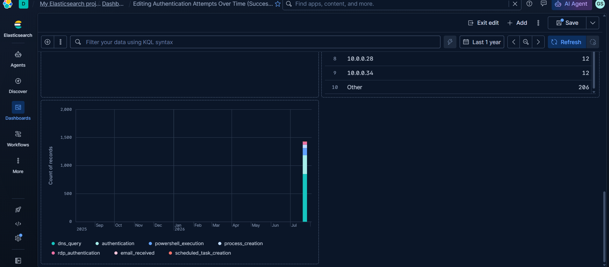
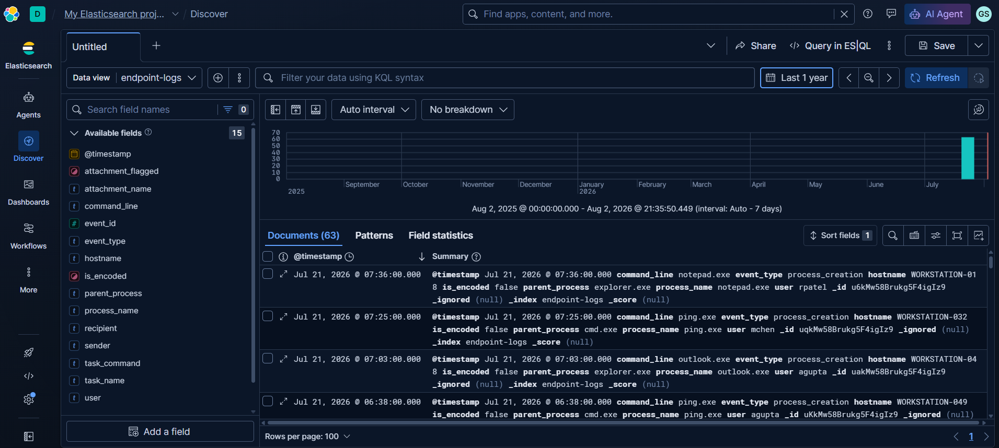
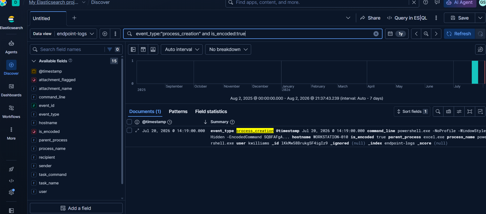
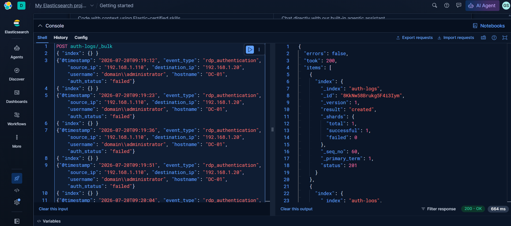

# Multi-Stage Attack Simulation — Detection & Threat Intelligence

A log-based simulation of a multi-stage attack chain — phishing → execution → persistence → lateral movement → credential access → DNS exfiltration — built to practice correlating signals across multiple log sources and producing reusable detection content, rather than requiring a live red-team/blue-team lab.

## Why a log-based simulation

Building a literal red-team/blue-team lab (a dedicated Windows domain, Security Onion, Wazuh, TheHive, MISP) requires infrastructure and installations beyond what was available for this exercise. Structured, realistic log data representing each attack stage was generated instead, which kept the focus on the actually-transferable skill for a SOC analyst role: detecting, correlating, and investigating activity from logs. No live exploitation or functional attack tooling (payloads, exploits, credential-dumping scripts) was created — only the defensive/detection side.

## Attack Timeline (simulated)

| Time | Stage | Event |
|---|---|---|
| 08:34 | Initial Access | Phishing email delivered with a macro-enabled attachment |
| 08:49 | Execution | `powershell.exe` spawned from `excel.exe` with an encoded command |
| 09:04 | Persistence | Scheduled task "Windows Defender Update Check" created (Event ID 4698) |
| 09:19 – 11:28 | Lateral Movement | 47 failed RDP attempts from the compromised workstation to the Domain Controller, then 1 success |
| (same window) | Credential Access | 35 failed logins from an external IP against 7 accounts |
| (same window) | Exfiltration | 450 abnormally long DNS queries (tunneling pattern) |

## Correlation Rules

| Rule | Detection Logic | Threshold / Window | Result |
|---|---|---|---|
| Malicious Encoded PowerShell Execution | `command_encoded:true` | Count > 2 / 15 min | 1 group: `DESKTOP-ABC123` (5) |
| Scheduled Task Persistence Detection | `event_type:"scheduled_task_creation"` | Count > 0 / 15 min | 1 group: `WORKSTATION-010` (1) |
| RDP Lateral Movement Detection | `event_type:"rdp_authentication" and auth_status:"failed"` | Count > 10 / 10 min | 1 group: `192.168.1.110` (47) |
| Credential Stuffing Detection | `auth_status:"failed"` | Count > 10 / 5 min | 1 group: `192.168.1.100` (35) |
| DNS Tunneling Detection | `query_name_length > 70` | Count > 50 / 10 min | 1 group: `192.168.1.105` (450) |
| Phishing Delivery Detection | `event_type:"email_received" and attachment_flagged:true` | Count > 0 / 15 min | 1 group: `kwilliams` (1) |

## Detection Content

- [`detection-rules/sigma_scheduled_task_persistence.yml`](./detection-rules/sigma_scheduled_task_persistence.yml) — generic Sigma rule for the persistence technique
- [`detection-rules/sigma_rdp_lateral_movement.yml`](./detection-rules/sigma_rdp_lateral_movement.yml) — generic Sigma rule for RDP brute-force/lateral movement
- [`detection-rules/yara_malicious_macro_document.yar`](./detection-rules/yara_malicious_macro_document.yar) — YARA rule for the macro-enabled document delivery pattern (validated to compile with `yara-python`)
- [`ioc_summary.md`](./ioc_summary.md) — indicators of compromise and recommended mitigations, formatted for threat-intel sharing

## Combined Attack Timeline

A single Kibana panel spanning all four log sources (`auth-logs`, `dns-logs`, `endpoint-logs`, `powershell-logs`), broken down by `event_type`, showing every stage of the attack chain concentrated on the simulated attack date:

## Data

Synthetic log data generator: [`generate_apt_logs.py`](./generate_apt_logs.py). Exported CSVs for each log source are in [`data/`](./data).

## Screenshots

