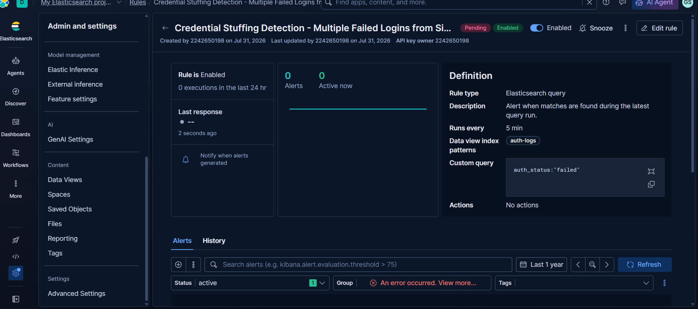

# SIEM Correlation Rules — Credential Stuffing, DNS Tunneling, PowerShell Exploitation

Three Kibana "Elasticsearch query" alerting rules, each detecting a distinct attack technique, built and validated on a synthetic dataset representing 24 hours of background network activity with one embedded attack scenario per log source.

## Environment

- Elasticsearch + Kibana (Elastic Cloud serverless project)
- Sample data generated with [`generate_logs.py`](./generate_logs.py) and loaded via the Elasticsearch Bulk API

## Rules

| Rule | Index | Detection Logic | Threshold / Window | Validated Result |
|---|---|---|---|---|
| Credential Stuffing Detection | `auth-logs` | `auth_status:"failed"`, grouped by `source_ip.keyword` | Count > 10 / 5 min | 1 group matched: `192.168.1.100` (35 failed attempts) |
| DNS Tunneling Detection | `dns-logs` | `query_name_length > 70`, grouped by `source_ip.keyword` | Count > 50 / 10 min | 1 group matched: `192.168.1.105` (450 long DNS queries) |
| Malicious PowerShell Execution | `powershell-logs` | `command_encoded:true`, grouped by `computer.keyword` | Count > 2 / 15 min | 1 group matched: `DESKTOP-ABC123` (5 encoded executions) |

Each rule was tested against the fixed-date sample data (using a temporarily widened evaluation window to reach the historical timestamps) before being reset to its realistic production time window — see the note on this in the write-up below.

## Screenshot

## Note on test vs. production windows

A rule's evaluation window (e.g., "last 5 minutes") is always relative to the current wall-clock time. Since the sample dataset here uses a fixed historical date, the window had to be temporarily widened purely to validate rule logic against that static data, then reset to the correct, realistic value before saving — an important distinction between testing against static sample data and how a rule behaves in a live environment with continuously arriving logs.
