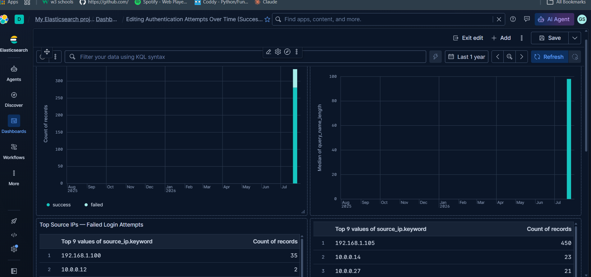
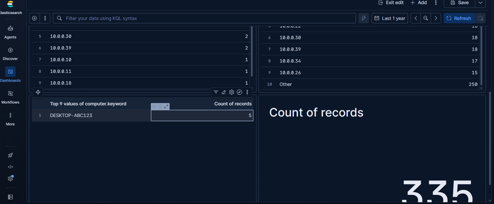
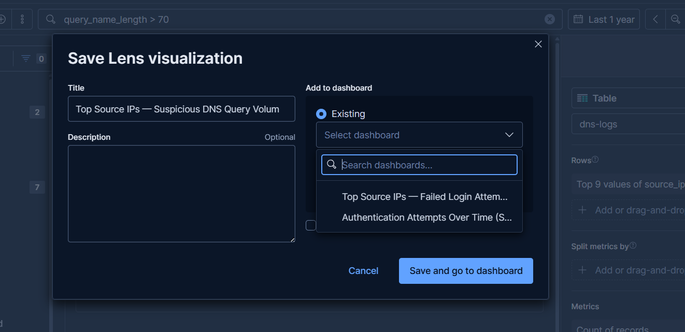

# SIEM Dashboard — Kibana Lens

A six-panel Kibana dashboard built on the same dataset and correlation rules from [`siem-correlation-rules`](../siem-correlation-rules), giving an analyst-facing view of the detections.

## Panels

| Panel | Data | Type | Key Insight |
|---|---|---|---|
| Authentication Attempts Over Time | `auth-logs` | Stacked bar (success vs. failed) | Visible spike in failed attempts on the attack date |
| DNS Query Name Length Over Time | `dns-logs` | Bar, median `query_name_length` | Sharp spike from ~10 chars baseline to 95+ chars |
| Top Source IPs — Failed Login Attempts | `auth-logs` (filtered) | Table | Isolates `192.168.1.100` (35 attempts) |
| Top Source IPs — Suspicious DNS Query Volume | `dns-logs` (filtered) | Table | Isolates `192.168.1.105` (450 queries) |
| Malicious PowerShell — Encoded Commands by Host | `powershell-logs` (filtered) | Table | Isolates `DESKTOP-ABC123` (5 executions) |
| Total Authentication Events Logged | `auth-logs` | Metric | 335 total events (volume baseline) |

## Screenshots

## A build note worth sharing

Early on, Kibana's "Add to dashboard" flow caused the first two panels to land on two separate, automatically-named dashboards instead of one shared dashboard:

This was resolved using Kibana's "Copy to dashboard" panel option to consolidate everything, and by building all subsequent panels directly inside the target dashboard's own Edit mode.
